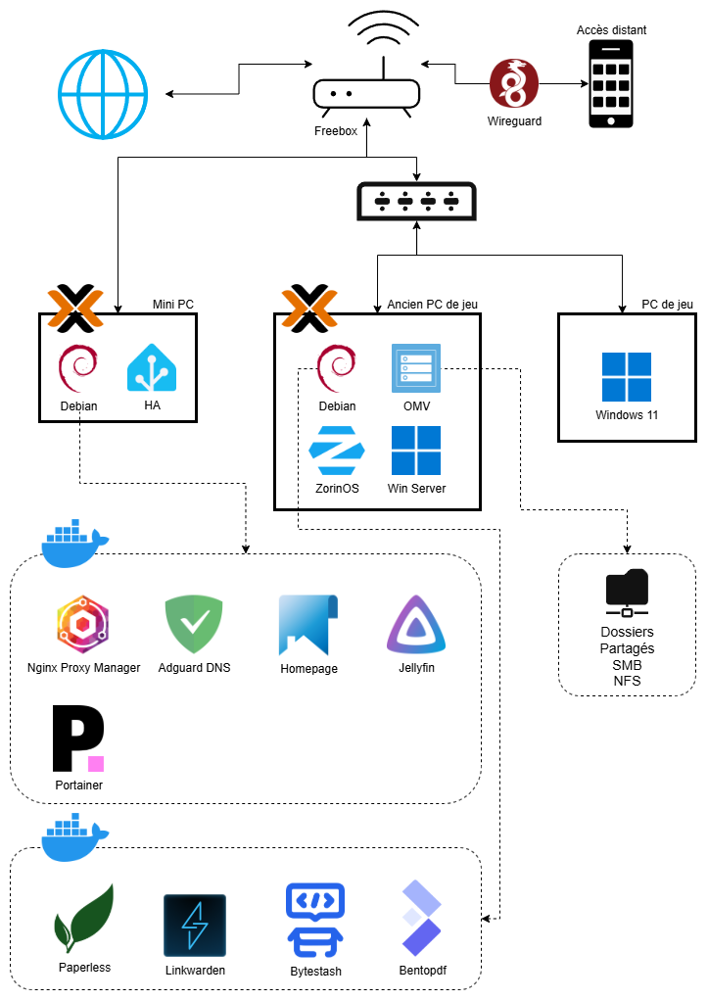

# Homelab de Germain

Bonjour, moi c’est Germain.

Cette page présente le fonctionnement de mon homelab ainsi que son organisation globale.

# Objectifs

Ce projet de homelab a été conçu pour :

* Disposer d’une bibliothèque multimédia accessible à tout moment
* Héberger des services utiles, disponibles 24h/24 et 7j/7
* Expérimenter, apprendre et monter en compétences en administration système et réseau

# En résumé

## Mini PC

Le Mini PC constitue la base de l’infrastructure. Il héberge les services essentiels au réseau et est optimisé pour une faible consommation énergétique.

Il exécute principalement :

* Les services réseau critiques (selon configuration actuelle)
* La stack multimédia (Jellyfin et services associés) temporairement, le temps d'avoir une vraie solution NAS

## Ancien PC de jeu

Cet ancien PC est utilisé comme serveur secondaire. Il sert principalement de NAS et de machine d’expérimentation.

Il héberge :

* OpenMediaVault (stockage NAS)
* Des services plus gourmands : BentoPDF, Bytestash, Linkwarden, Paperless
* Divers scripts Python persos (Fetch API et outils d'OCR et de vision)
* Des environnements de test (Windows Server, ZorinOS)

# Schéma du homelab

# Matériel

## Machines

### Un mini PC
  * HDD externe 1To
  * Dongle Zigbee Sonoff (domotique)

### Ancien PC de jeu
  * Carte graphique GTX 1070
  * HDD 2To
  * HDD 1To

## Réseau

### Routeur

* Freebox Pop (gestion DHCP et accès Internet)

### Switch

* Netgear GS308E (8 ports manageable)

# Logiciels

* [Proxmox VE](https://www.proxmox.com/en/) : plateforme de virtualisation basée sur Debian, permettant la gestion de machines virtuelles (KVM/QEMU) et de conteneurs (LXC) via une interface web.

* [WireGuard](https://www.wireguard.com/) : solution VPN légère et performante utilisée pour l’accès distant sécurisé au réseau local via la Freebox.

* [AdGuard Home](https://adguard.com/en/adguard-home/overview.html) : serveur DNS local avec filtrage des publicités et du tracking pour améliorer la confidentialité et la sécurité du réseau.

* [Nginx Proxy Manager](https://nginxproxymanager.com/) : reverse proxy avec interface web permettant de router les requêtes vers les services internes et de gérer facilement les certificats SSL (Let’s Encrypt).

* [Portainer](https://www.portainer.io/) : interface web de gestion des conteneurs Docker, facilitant le déploiement, la supervision et la maintenance des services.

* [Home Assistant](https://www.home-assistant.io/) : plateforme domotique permettant de centraliser et d’automatiser les équipements connectés de la maison.

# Configuration

## Réseau

* Le serveur DHCP est géré directement par la Freebox.

* L’accès distant au réseau est assuré par WireGuard, configuré sur la Freebox, permettant un accès sécurisé au réseau local comme si l’on était sur place.

* Les machines Proxmox utilisent des adresses IP fixes, définies en dehors de la plage DHCP afin d’éviter les conflits réseau.

* Les sous-domaines sont gérés via OVH et résolvent vers l’adresse locale du réseau, où se trouve le reverse proxy (Nginx Proxy Manager). L’accès aux services se fait uniquement depuis le réseau privé, notamment via WireGuard.

* Le reverse proxy est utilisé en interne pour router les requêtes vers les différents services Docker en fonction du nom de domaine. Il permet également de centraliser la gestion des certificats SSL.

* À venir :
  * Mise en place de VLANs afin d’isoler les différents segments du réseau (invités, services critiques, domotique) et améliorer la sécurité globale.
  * Déploiement d’une solution VoIP pour la téléphonie sur IP au sein du réseau local.
  * Mise en place d’un système de vidéosurveillance NVR avec [Frigate](https://frigate.video/) pour la gestion des caméras de sécurité.

## Proxmox

### Mini PC

* Debian

  * Docker Engine
* Home Assistant

### Ancien PC de jeu

* Debian

  * Docker Engine
* OpenMediaVault

  * Stockage NAS (partages réseau)
* Machines virtuelles de test :

  * ZorinOS
  * Windows Server

### Sauvegardes et snapshots

* Utilisation des snapshots Proxmox pour figer l’état des machines virtuelles avant modification ou mise à jour.
* Mise en place de sauvegardes régulières des VMs et containers via Proxmox Backup Tooling.
* Objectif : pouvoir restaurer rapidement un service en cas de panne ou de mauvaise manipulation.

# Monitoring

* [Homepage](https://gethomepage.dev/) : dashboard centralisé permettant d’accéder à tous les services et de vérifier leur état en temps réel.

* À venir : mise en place d’une stack de monitoring complète avec [Prometheus](https://prometheus.io/) et [Grafana](https://grafana.com/) pour la collecte et la visualisation des métriques.

*Homepage avec CSS custom*

# Améliorations à apporter

* Passage à Proxmox 9 sur toutes les machines afin de bénéficier de la gestion en cluster et de les piloter depuis une seule interface.
* Achat de 3 disques supplémentaires et mise en place d’un RAID5 pour utiliser pleinement OpenMediaVault en NAS redondant et sécurisé.
* Migration de Jellyfin et de ses services vers l’ancien PC de jeu afin de bénéficier du stockage local et du transcodage GPU.
* Mise en place d’une stratégie de sauvegarde plus robuste avec stockage externe (cloud ou serveur distant).
* Mise en place d’une approche Infrastructure as Code avec [Ansible](https://www.ansible.com/) afin d’automatiser la configuration et le déploiement des services, améliorer la reproductibilité de l’infrastructure et réduire les erreurs de configuration manuelles.
* Amélioration de la gestion des droits et permissions des conteneurs pour limiter les accès inutiles.
* Utilisation plus rigoureuse des réseaux virtuels Proxmox et Docker pour une architecture plus propre, segmentée et maintenable.
* Renforcement de la sécurité d’accès aux documents sensibles (Paperless notamment).

# Problèmes rencontrés

* Tentative de gestion des sous-domaines via AdGuard Home en local : l’absence de certificats SSL valides entraînait des alertes de sécurité dans les navigateurs. Une migration vers OVH a permis d’utiliser des certificats SSL fiables.

* Mauvaise configuration de l’ordre de démarrage sur Proxmox : les services Docker démarraient avant OpenMediaVault, rendant les données NAS inaccessibles et provoquant des erreurs.

* Surcharge du Mini PC : trop de services (DNS, reverse proxy, etc.) étaient concentrés sur une seule machine, ce qui dégradait les performances globales et la stabilité de certains services.
